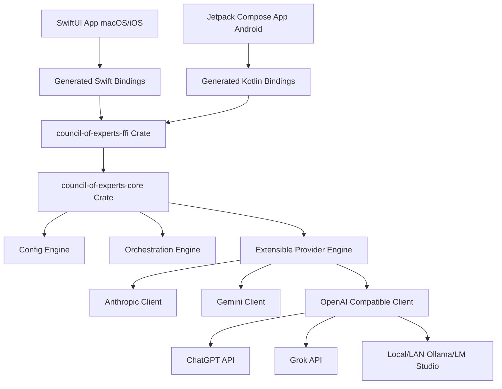

# Architecture and Roadmap — Council-of-Experts

This document details the multi-platform architectural design and the implementation roadmap for the Council-of-Experts framework.

---

## 🏗️ Rust Core + UniFFI Architecture

To ensure the core intelligence and orchestration logic can easily target macOS, iOS, Windows, and Android, we will build the foundation in **Rust** and bridge it to Swift (and other target languages) using **UniFFI**.



### 1. Extensible & Config-Based Providers

We will define a common provider trait in Rust. Because many services (ChatGPT, Grok, Ollama, LM Studio, vLLM) use the standard OpenAI JSON payload format, we can support them all using a single, highly flexible `OpenAiProvider` configured with custom base URLs.

```rust
// Sketch of the core trait in council-of-experts-core
#[async_trait]
pub trait LlmProvider: Send + Sync {
    async fn generate(&self, prompt: &str, history: &[Message], config: &ProviderConfig) -> Result<String, ProviderError>;
    async fn generate_stream(&self, prompt: &str, history: &[Message], config: &ProviderConfig) -> Result<BoxStream<'static, Result<String, ProviderError>>, ProviderError>;
}
```

#### Provider Configurations
Configurations will be represented as serializable data structures:

```json
{
  "experts": [
    {
      "id": "claude-reasoner",
      "name": "Claude Security Critic",
      "provider": "anthropic",
      "model": "claude-3-5-sonnet-latest",
      "system_prompt": "You are a senior security critic..."
    },
    {
      "id": "local-coder",
      "name": "Local Qwen Coder",
      "provider": "openai-compatible",
      "model": "qwen2.5-coder:7b",
      "base_url": "http://192.168.1.50:11434/v1",
      "system_prompt": "You are a local coding assistant..."
    }
  ]
}
```

---

## 💡 Agentic Design Philosophy & Inspirations

While we draw inspiration from state-of-the-art agentic tools—such as **Antigravity 2.0**, **Claude Code**, and **OpenAI Codex**—our system is designed to form a unique, vendor-independent platform:

*   **Diverse Consensus Mechanics**: Instead of a single model orchestrating all subagents, we leverage a multi-vendor council where different models critique, vote, and build upon each other's code modifications in parallel.
*   **Decoupled Multi-Platform Core**: A high-performance, memory-safe Rust core that handles raw FFI boundaries, allowing native, high-fidelity SwiftUI macOS apps to run the front-end, with easy ports to Android and Windows.
*   **Tandem Isolation**: Designing orchestrators to allow agents from different vendors to work in isolated code threads concurrently without blocking each other.

---

## 🧭 Initial Implementation Roadmap


### Milestone 1: Rust Core Foundation (Scaffolding & FFI) [COMPLETED]
*   [x] Set up Rust workspace with `core` and `ffi` crates.
*   [x] Build serializable `ProviderConfig`, `Expert`, and `Message` models.
*   [x] Set up UniFFI bridge generation for macOS/iOS targets.

### Milestone 2: Provider Integration (The Big 4 + Local) [COMPLETED]
*   [x] Implement **Anthropic Provider** (Claude Messages API).
*   [x] Implement **Gemini Provider** (Google Gemini API).
*   [x] Implement **OpenAI Provider** (ChatGPT API).
*   [x] Verify that the OpenAI Provider supports LAN-hosted standards (Ollama, LM Studio) by configuration of `base_url`.
*   [x] Implement **Grok Provider** (via the OpenAI Compatible client or xAI custom endpoint).

### Milestone 3: Council Orchestrator (Consensus & Synthesis) [COMPLETED]
*   [x] Implement parallel query execution across active experts.
*   [x] Implement the `Chairman` synthesis workflow in Rust.
*   [x] Expose async streaming callbacks across UniFFI to Swift.
*   [x] Implement multi-agent parallel critique loop consensus.
*   [x] Replace the single opening+critique pass with a configurable N-round discussion (opening statement → reaction rounds → closing statement).
*   [x] **Removed** the `Chairman`/"Gaston" synthesis step (2026-07-14) — real-world testing found it wasn't earning its keep while individual provider integrations (Anthropic, Gemini, OpenAI) still had live bugs (temperature rejection on newer models, broken Gemini streaming parsing) that made a synthesis step unreliable on top of already-unreliable inputs. The council is now a flat list of up to 8 standard expert cards with no synthesizer.

### Milestone 4: Native macOS UI Testbed [COMPLETED]
*   [x] Scaffold the universal SwiftUI App.
*   [x] Build dynamic grid layout and sidebar configuration editors.
*   [x] Wire UI to Rust Core streams and integrate critique segmented views.
*   [x] Move credentials to native macOS Settings panel.

### Milestone 5: Multi-Turn Conversation Logs & Session Persistence [SUGGESTED]
*   [ ] Implement multi-turn conversational history logging.
*   [ ] Add local session serialization and database persistence.

### Milestone 6: Multimodal Inputs & Media Integration [SUGGESTED]
*   [ ] Add support for image and multimodal inputs in the council flow.

### Milestone 7: Local Directory Integration [SUGGESTED]
*   [ ] Expose path configuration in the app settings or sidebar to set a local directory.
*   [ ] Scan, index, and load files inside the target directory.
*   [ ] Allow experts to read specific files and form collaborative discussion groups around code segments.

### Milestone 8: Multi-Source Agentic Coding Platform [SUGGESTED]
*   [ ] Evolve the council system into an agentic coding platform that utilizes multiple AI sources/models simultaneously.
*   [ ] Allow different agents (potentially from different vendors, e.g., Claude for refactoring, Gemini for code analysis, ChatGPT for test writing) to work in tandem across separate files or code boundaries simultaneously.

### Milestone 9: Revisit Chairman/Synthesis Role [SUGGESTED — deferred]
*   [ ] Reconsider a synthesis/"Chairman" step once all provider integrations are solid (temperature handling, streaming parsers, thinking-mode interactions) and the multi-round discussion format has proven itself in real use.
*   [ ] If reintroduced, evaluate whether it should stay a single dedicated model/persona (as Gaston was) or become an on-demand summarization action the user triggers manually, rather than an implicit step every discussion runs through.


