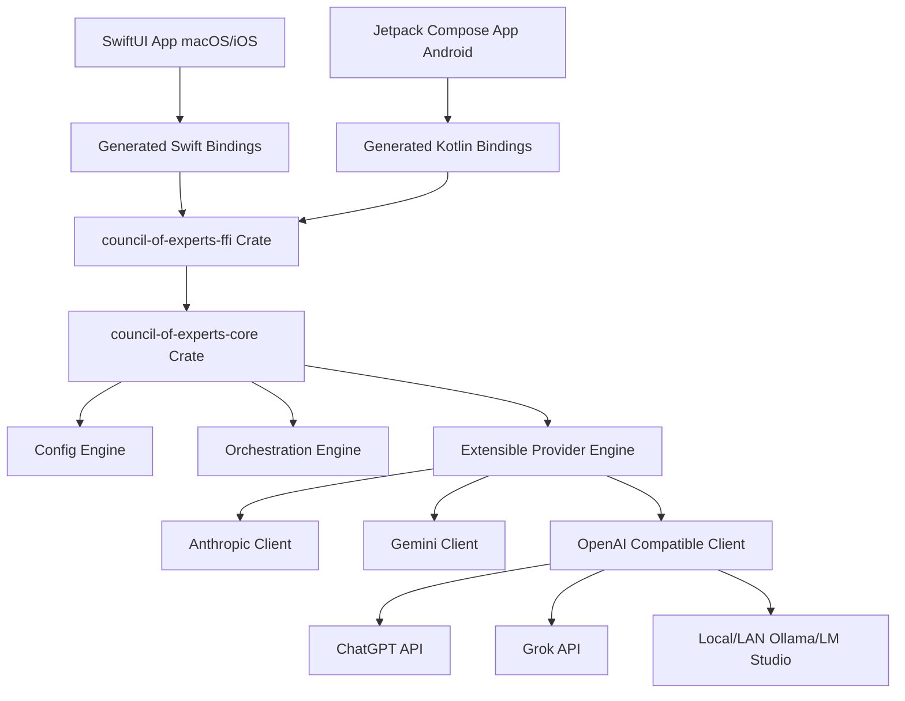

# Architecture and Roadmap — Council-of-Experts

This document details the multi-platform architectural design and the implementation roadmap for the Council-of-Experts framework.

---

## 🏗️ Rust Core + UniFFI Architecture

To ensure the core intelligence and orchestration logic can easily target macOS, iOS, Windows, and Android, we will build the foundation in **Rust** and bridge it to Swift (and other target languages) using **UniFFI**.



### 1. Extensible & Config-Based Providers

We will define a common provider trait in Rust. Because many services (ChatGPT, Grok, Ollama, LM Studio, vLLM) use the standard OpenAI JSON payload format, we can support them all using a single, highly flexible `OpenAiProvider` configured with custom base URLs.

```rust
// Sketch of the core trait in council-of-experts-core
#[async_trait]
pub trait LlmProvider: Send + Sync {
    async fn generate(&self, prompt: &str, history: &[Message], config: &ProviderConfig) -> Result<String, ProviderError>;
    async fn generate_stream(&self, prompt: &str, history: &[Message], config: &ProviderConfig) -> Result<BoxStream<'static, Result<String, ProviderError>>, ProviderError>;
}
```

#### Provider Configurations
Configurations will be represented as serializable data structures:

```json
{
  "experts": [
    {
      "id": "claude-reasoner",
      "name": "Claude Security Critic",
      "provider": "anthropic",
      "model": "claude-3-5-sonnet-latest",
      "system_prompt": "You are a senior security critic..."
    },
    {
      "id": "local-coder",
      "name": "Local Qwen Coder",
      "provider": "openai-compatible",
      "model": "qwen2.5-coder:7b",
      "base_url": "http://192.168.1.50:11434/v1",
      "system_prompt": "You are a local coding assistant..."
    }
  ]
}
```

---

## 💡 Agentic Design Philosophy & Inspirations

While we draw inspiration from state-of-the-art agentic tools—such as **Antigravity 2.0**, **Claude Code**, and **OpenAI Codex**—our system is designed to form a unique, vendor-independent platform:

*   **Diverse Consensus Mechanics**: Instead of a single model orchestrating all subagents, we leverage a multi-vendor council where different models critique, vote, and build upon each other's code modifications in parallel.
*   **Decoupled Multi-Platform Core**: A high-performance, memory-safe Rust core that handles raw FFI boundaries, allowing native, high-fidelity SwiftUI macOS apps to run the front-end, with easy ports to Android and Windows.
*   **Tandem Isolation**: Designing orchestrators to allow agents from different vendors to work in isolated code threads concurrently without blocking each other.

---

## 🧭 Initial Implementation Roadmap


### Milestone 1: Rust Core Foundation (Scaffolding & FFI) [COMPLETED]
*   [x] Set up Rust workspace with `core` and `ffi` crates.
*   [x] Build serializable `ProviderConfig`, `Expert`, and `Message` models.
*   [x] Set up UniFFI bridge generation for macOS/iOS targets.

### Milestone 2: Provider Integration (The Big 4 + Local) [COMPLETED]
*   [x] Implement **Anthropic Provider** (Claude Messages API).
*   [x] Implement **Gemini Provider** (Google Gemini API).
*   [x] Implement **OpenAI Provider** (ChatGPT API).
*   [x] Verify that the OpenAI Provider supports LAN-hosted standards (Ollama, LM Studio) by configuration of `base_url`.
*   [x] Implement **Grok Provider** (via the OpenAI Compatible client or xAI custom endpoint).

### Milestone 3: Council Orchestrator (Consensus & Synthesis) [COMPLETED]
*   [x] Implement parallel query execution across active experts.
*   [x] Implement the `Chairman` synthesis workflow in Rust.
*   [x] Expose async streaming callbacks across UniFFI to Swift.
*   [x] Implement multi-agent parallel critique loop consensus.
*   [x] Replace the single opening+critique pass with a configurable N-round discussion (opening statement → reaction rounds → closing statement).
*   [x] **Removed** the `Chairman`/"Gaston" synthesis step (2026-07-14) — real-world testing found it wasn't earning its keep while individual provider integrations (Anthropic, Gemini, OpenAI) still had live bugs (temperature rejection on newer models, broken Gemini streaming parsing) that made a synthesis step unreliable on top of already-unreliable inputs. The council is now a flat list of up to 8 standard expert cards with no synthesizer.

### Milestone 4: Native macOS UI Testbed [COMPLETED]
*   [x] Scaffold the universal SwiftUI App.
*   [x] Build dynamic grid layout and sidebar configuration editors.
*   [x] Wire UI to Rust Core streams and integrate critique segmented views.
*   [x] Move credentials to native macOS Settings panel.

### Milestone 5: Multi-Turn Conversation Logs & Session Persistence [COMPLETED]
*   [x] Implement multi-turn conversational history logging.
*   [x] Add local session serialization and database persistence.
*   [x] **Correctness pass (2026-08-01)** — the first implementation sent every expert's output to every other expert as an unlabeled `assistant` turn, which Gemini rejected outright (invalid role), Anthropic rejected as non-alternating, and which told each model it had authored its rivals' statements. History is now normalized once in the core: authored, merged, and trimmed to start at a user turn.

### Milestone 6: Multimodal Inputs & Media Integration [COMPLETED]
*   [x] Add support for image and multimodal inputs in the council flow.

### Milestone 7: Local Directory Integration [COMPLETED]
*   [x] Expose path configuration in the app settings or sidebar to set a local directory.
*   [x] Scan, index, and load files inside the target directory.
*   [x] Allow experts to read specific files and form collaborative discussion groups around code segments.

### Milestone 8: Multi-Source Agentic Coding Platform [FIRST PASS — REDESIGN REQUIRED]
*   [x] Evolve the council system into an agentic coding platform that utilizes multiple AI sources/models simultaneously.
*   [x] Sandbox safety: workspace-relative path containment for model-proposed file writes (2026-08-01). Traversal, absolute paths, and symlink escapes are refused and reported.
*   [ ] **Decide the consensus mechanic before building further.** The first pass has every expert write complete files into one shared workspace, applied in expert order — so the last writer silently wins on any shared path and the build verifies that blend rather than any single expert's coherent proposal. That is the opposite of the Tandem Isolation and diverse-consensus philosophy above. Collisions are currently reported but not resolved. Candidate designs:
    *   **Champion selection** — each expert proposes a full patch set, each is applied to an isolated copy (or git worktree) and built/tested independently, and the passing or panel-selected candidate is applied to the real workspace.
    *   **Partitioned tandem work** — an explicit up-front split of files or modules per expert, so concurrent writes cannot collide.
*   [ ] Allow different agents (potentially from different vendors, e.g., Claude for refactoring, Gemini for code analysis, ChatGPT for test writing) to work in tandem across separate files or code boundaries simultaneously.

### Milestone 9: Reinstate the Chairman/Synthesis Role [ACTIVE — removal was likely premature]

The Chairman was removed on 2026-07-14 because synthesis sat on top of provider integrations that were actively broken, not because the idea failed on its merits. That distinction got lost in the removal, and on reflection the concept still holds: a discussion that ends with N closing statements makes the reader do the reconciliation the council exists to perform.

Three things have changed since the removal:

*   **The stated precondition has largely been met.** The bugs that made synthesis untrustworthy are fixed — `temperature` rejection on reasoning-tier models and Gemini's streaming parser (2026-07-14), then Gemini's invalid history role, Anthropic's non-alternating roles, and UTF-8 corruption at SSE chunk boundaries (2026-08-01). The inputs a Chairman would read are now sound in a way they were not when it was cut.
*   **Independent convergence on the design.** A separately developed commercial product in this space (gather → anonymous peer review → chairman synthesis) treats the synthesis step as its central value claim rather than an optional extra. That is not proof it's correct, but it is evidence the step earns its keep for a general audience, arrived at by someone who had no visibility into this project's reasoning.
*   **Audience clarity.** This project's user is a technologist who cloned the repo to watch models disagree, and who plausibly wants the raw cards more than a verdict. That argues for synthesis being available rather than mandatory.

Design direction:

*   [ ] Reinstate synthesis as an **on-demand action** — a "Synthesize" control the user triggers after a discussion completes — rather than the implicit final step every discussion ran through before. This keeps the panel transcript primary for the technologist audience while making one reconciled answer one click away.
*   [ ] Decide whether the synthesizer is a dedicated configured model/persona (as Gaston was) or simply reuses a chosen panelist's provider config.
*   [ ] Consider borrowing **anonymized peer review** before synthesis: presenting each expert's statements under neutral labels rather than named panelists, so the synthesizer weighs arguments rather than model reputation. The current reaction rounds already label panelists by ID; anonymity would be a small prompt-construction change with a plausible bias benefit.
*   [ ] Attach a confidence signal to the synthesized answer (degree of panel agreement), which is more honest than a bare verdict and is the natural payoff of having run a debate at all.
*   [ ] Validate against Milestone 10 rather than by feel: does a synthesized answer actually beat the best individual closing statement?

### Milestone 10: Evaluation Harness [SUGGESTED]

The project's central premise — that a heterogeneous panel debating over several rounds beats a single strong model — is currently unmeasured, and it drives nearly every open design question. The multi-agent-debate literature reports real gains but also documents convergence and sycophancy, with returns flattening or inverting past roughly two to three rounds.

*   [ ] Run a fixed question set through three configurations: a single model, the council at 2 rounds, and the council at 4 rounds.
*   [ ] Score factual accuracy and answer quality, and check whether panelists converge over rounds (measure how much positions actually change after round 2).
*   [ ] Use the result to set the default round count, decide Milestone 9, and confirm the premise holds at all.


